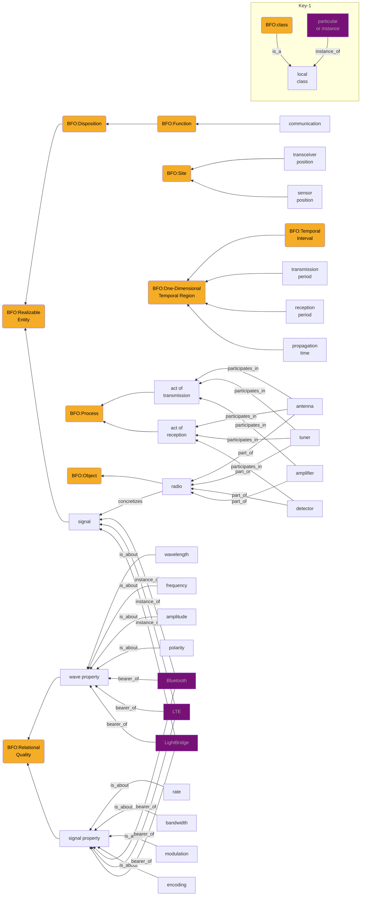

# RF pattern draft, third pass
## Competency Questions
 - What transmission properties are defined by a given protocol?
 - What protocols are normally found at a given frequency?
 - What attribute measurements are required to identify a given protocol?
 - What hardware is required to detect a given protocol?
 - Where and when are detections or emitters sensed?


```
+-Key-0--------------------------------------+
| arrows are relations                       |
| relation is "is_a" unless marked otherwise |
| all nodes are classes unless purple        |
| purple nodes are particulars/instances     |
+--------------------------------------------+
```

from https://github.com/BFO-ontology/BFO-2020

## test cases
 - IEEE 802.11b. freq: 2.4GHz, 12-14 channels. rate: 1-11Mbit/s. bandwidth: 22MHz. modulation: Freq Hopping Spread Spectrum DBPSK, DQPSK, or QPSK. wavelength: 13cm
 - TBS XF. freq: 915 or 868MHz, 100 channels. rate: 50 or 150Hz. bandwidth: 5 or 2.5MHz. modulation: Chirp Spread Spectrum. wavelength: 32cm 
 - FT8. freq: HF, see table. rate: 5.86Hz. bandwidth: 47Hz. modulation: multiple frequency-shift keying (MSFK). wavelength: see table.

| λ (m) | f (MHz) |
|-------|:-------:|
| 160m  | 1.840   |
| 80m   | 3.573   |
| 40m   | 7.074   |
| 30m   | 10.136  |
| 20m   | 14.074  |
| 17m   | 18.100  |
| 15m   | 21.074  |
| 12m   | 24.915  |
| 10m   | 28.074  |
| 6m    | 50.313  |
| 2m    | 144.174 |

# Noted ambiguities:
 - not all protocols define freq, bandwidth, rate, modulation, and wavelength
 - wavelength, frequency, bandwidth, and rate are mathematically interdependent
 - sometimes one or more of these variables defines the protocol instead, probably
 - sometimes none of them serve to define. CW is defined purely by encoding only, and is just as usable in longitudinal waves as it is in transverse waves.
