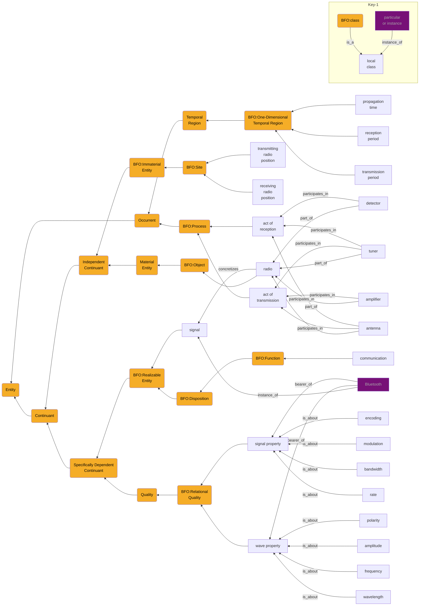

# RF pattern, fourth pass
## 1. Motivation
<= 200 word description motivating the need for your design pattern.

- What problem or represesntational gap does it address?
- Why is a formal pattern needed for this topic?
- Keep your descriptions clea, concise, and tied to a real modeling need.

This design pattern is meant to describe the equipment, parts, and information necessary to detect and identify a bluetooth transmission and to infer position by proximity of the device emitting that signal. The design pattern is needed to allow consistent handling of varying hardware and software.

## 2. Competency Question: What is required to locate BlueTooth protocol emissions?

## 3. Construction explanation

<= 500 words
Describe how you consturcted your design pattern, following the modeling recipe from class.
  - identify classes
  - material entities within scope
  - qualities these materials have
  - What these material entities could do, i.e. Realizable Entity
  - What these material entities actually do, i.e. Process
  - Where these material entities and boundaries are located, i.e. Immaterial Entity
  - When these entities exist, i.e. Temporal Region
  - Information we use to talk about 1-6, i.e. Generically Dependent Continuant
Note: Asterisk next to ambiguous terms and revisit them after working through each class.
Disambiguate based on the competency question identified.
Step 2:
Using the classes identified, provide relations to connect them according to BFO:
  - Qualities to material entities, i.e. inheres in
  - Realizables to material entities, i.e. inheres in, has material basis
  - Processes to material entities, i.e participates in
  - Realizables to processes, i.e. has realization
  - Immaterial location of material entity, i.e. located in
  - When any such entities exist, i.e. exists at, datatype property
  - When any such entities carry information, e.g. generically depends on

This pattern has been cut from a somewhat broader design intended to provide for identification of multiple protocols and properties. The "whole cloth" design pattern found at https://github.com/John-D-4/design-patterns/blob/main/design-patterns/pattern3.md also handles additional example transmission types like cell phone and ism band activity, which further requires wave property discrimination.
To fulfill a single design question and sharpen the focus, this final model eliminated activity in other rf bands and trimmed out classes and relationships which do not apply to bluetooth activity. 
In both the wider scope and this narrower scope, the hardware remains the same, with radio components and physics attributes required to perform transmission and reception. Author chose to consider digital signal processing and edge bitwise processing to be integral to the radio, and to discount the need for further information storage/processing as outside the scope of this competency question.

## 4. Visual Display of the Design Pattern

  

```
+-Key-0--------------------------------------+
| arrows are relations                       |
| relation is "is_a" unless marked otherwise |
| all nodes are classes unless purple        |
| purple nodes are particulars/instances     |
+--------------------------------------------+
```

from https://github.com/BFO-ontology/BFO-2020

https://github.com/BFO-ontology/BFO-2020/blob/master/documentation/axiomatization-pds/occurrent-mereology.pdf

5. Feedback Evidence
Show that you have presented your design pattern to at least one other UB applied ontology student and received feedback.
  - You can easily fulfill this requirement by posting your design pattern in the Slack channel and noting who responded.
Mike B noted apparent disconnects across the pattern where BFO classes were only marked as references. For this final revision, based on that feedback, author reinstated all nodes such that none are edgeless.

  - Alternatively, you can share by email or in-person and note who provided comments.
  - Include a brief summary (1–2 sentences) of the feedback you received and any changes
you made as a result.
Submission Details:
  - Submit a single document (PDF preferred) with these five sections clearly labeled.
