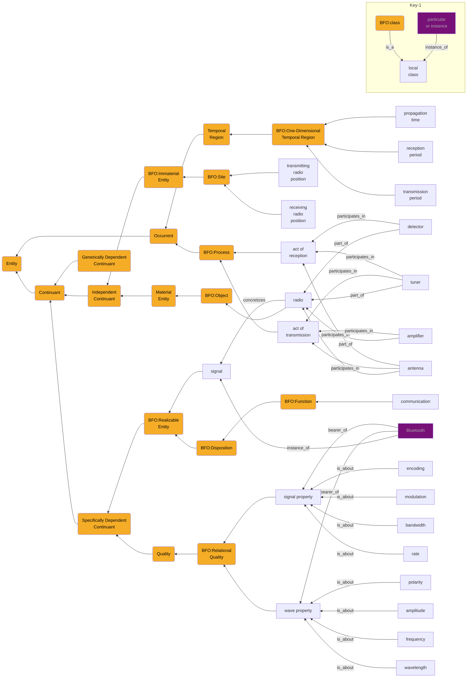

# RF pattern, fourth pass
## Competency Question: What is required to locate BlueTooth protocol emissions?


```
+-Key-0--------------------------------------+
| arrows are relations                       |
| relation is "is_a" unless marked otherwise |
| all nodes are classes unless purple        |
| purple nodes are particulars/instances     |
+--------------------------------------------+
```

from https://github.com/BFO-ontology/BFO-2020

https://github.com/BFO-ontology/BFO-2020/blob/master/documentation/axiomatization-pds/occurrent-mereology.pdf
